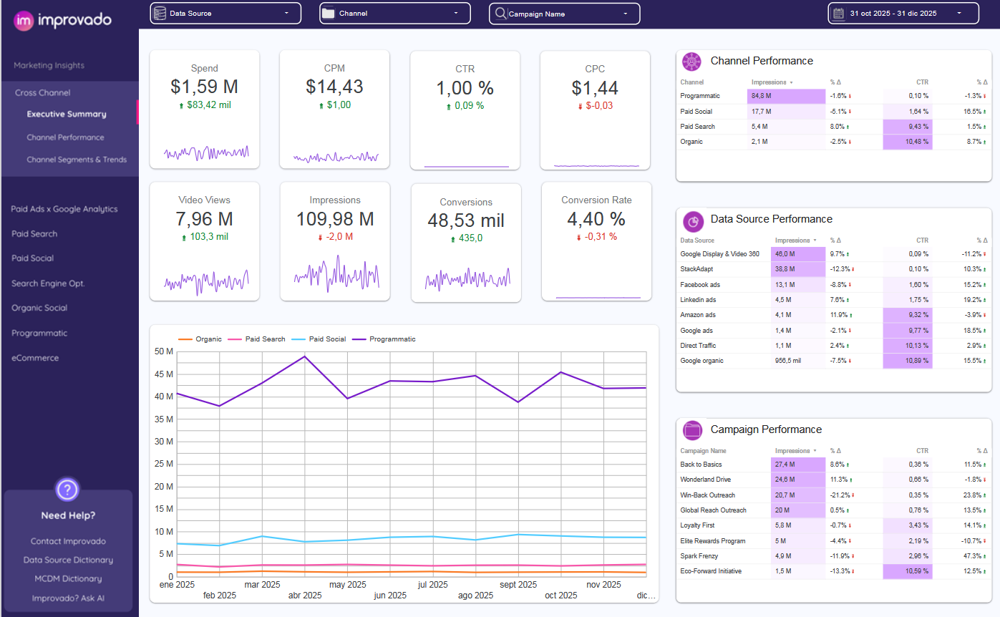

Marketing Analytics Dashboard: Technical Re-Engineering \& Visualization

Este proyecto consiste en la recreación técnica de un Dashboard de Marketing avanzado, enfocado en la integridad de los datos y la visualización de KPIs estratégicos. El reto principal fue transformar un diseño visual estático en un sistema funcional con datos realistas generados mediante un algoritmo relacional.

🚀 Resumen del Proyecto

El objetivo fue replicar un "Executive Summary" de marketing para una posición de Technical Customer Success. A diferencia de una copia visual simple, este proyecto incluyó el desarrollo de un motor de datos en Python para garantizar que las métricas (CPM, CPC, CTR) reflejaran el comportamiento real de la industria.

🛠️ Stack Tecnológico

&#x20;   Generación de Datos: Python (Pandas, Numpy) - Estructura relacional de campañas y fuentes.

&#x20;   Visualización: Google Looker Studio.

&#x20;   Gestión de Datos: Google Sheets / CSV.

&#x20;   Análisis de Negocio: Definición de KPIs de embudo de conversión (Funnel Analytics).

🧠 El Enfoque de Ingeniería: "Data Realism"

Uno de los mayores desafíos fue detectar que los datos del modelo original eran matemáticamente inconsistentes. Para resolverlo, desarrollé un algoritmo en Python que simula la "Eficiencia Natural" de los canales de marketing:

&#x20;   Arquitectura Relacional: Se mapearon 8 campañas específicas a fuentes de datos y canales predefinidos (ej. Programmatic vinculado a StackAdapt).

&#x20;   Lógica de Probabilidad: Implementé un sistema de asignación diaria donde las campañas tienen un 70% de probabilidad de recurrencia, simulando la persistencia de una estrategia real.

&#x20;   Restricciones de KPIs:

&#x20;       Programmatic: Volumen masivo de impresiones con CTR bajo (Brand Awareness).

&#x20;       Paid Search/Organic: Volumen bajo pero con alta intención de clic y conversión (Performance).

📊 Visualización e Insights

El dashboard final incluye:

&#x20;   Scorecards con Sparklines: Visualización de tendencias inmediatas con comparación de periodos anteriores.

&#x20;   Time-Series Analysis: Desglose del tráfico por canal para detectar anomalías en el gasto e impacto.

&#x20;   Tablas de Rendimiento: Mapas de calor (Heatmaps) para identificar rápidamente qué fuentes están optimizando mejor el presupuesto.

https://datastudio.google.com/reporting/6f5190d3-1a96-4b62-ad7a-c72a43400344

Insights Clave:

&#x20;   El canal de Paid Search mantiene un CTR del \~10%, validando una estrategia de captura de demanda efectiva.

&#x20;   El costo por mil impresiones (CPM) se estabilizó en un benchmark real de \~$14 USD, corrigiendo las anomalías del diseño original.

🎥 Video Demo

Puedes ver el desglose técnico y la explicación de la arquitectura del dashboard en este video:

https://www.youtube.com/watch?v=wUXgIsMtziQ

