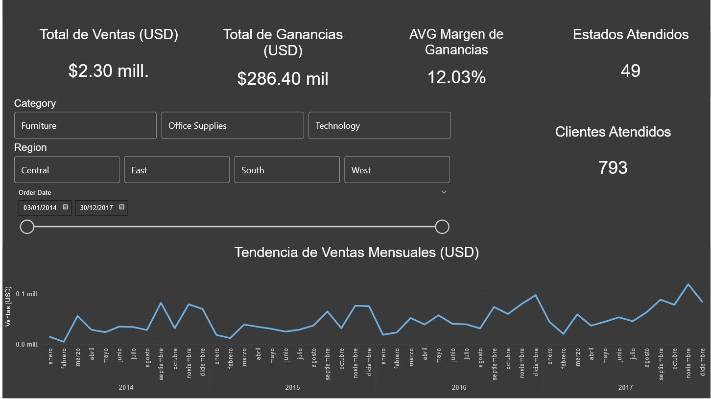

# Superstore Sales Analysis

## 📌 Project Overview
This project analyzes sales and profitability data from a retail superstore.
The objective is to identify sales trends, regional performance, and product profitability,
and to propose actionable insights based on the analysis.

## 🛠 Tools Used
- Python (Pandas, Matplotlib)
- Jupyter Notebook / Google Colab
- Power BI

## 📊 Analysis Scope
- Sales and profit KPIs
- Monthly sales trends
- Profitability by category, product, and region
- Identification of high-volume low-margin products

## 📓 Notebook
The notebook includes:
- Data cleaning
- Feature engineering (profit margin)
- Exploratory analysis
- Visualizations
- Business-oriented conclusions

## 📈 Power BI Dashboard
The dashboard provides an interactive view of:
- Overall performance KPIs
- Sales trends over time
- Regional and category breakdown
- Profitability comparison

## 📂 Dataset
Sample Superstore dataset (publicly available).

## 🔍 Key Insights
- Technology leads in total sales, but not always in margin.
- Some regions show high sales with relatively low profitability.
- Several high-volume products generate low or negative margins.

## 🚀 Next Steps
- Deeper segmentation by customer and sub-category
- Advanced DAX measures
- Scenario-based profitability analysis

## 🖼 Dashboard Preview

